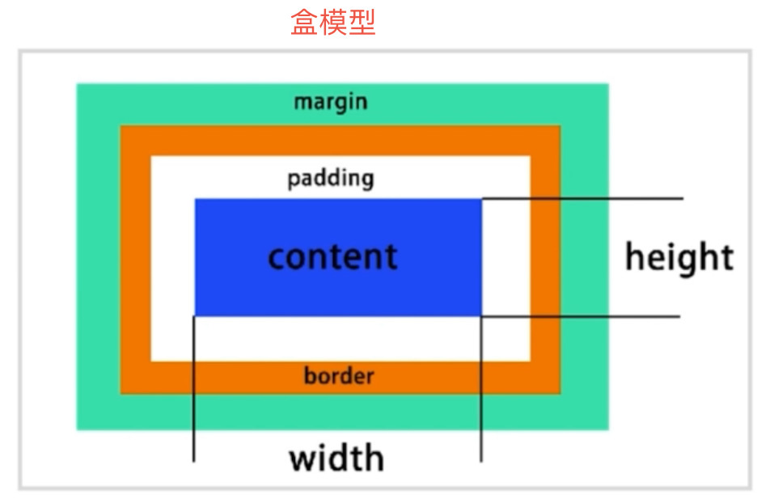
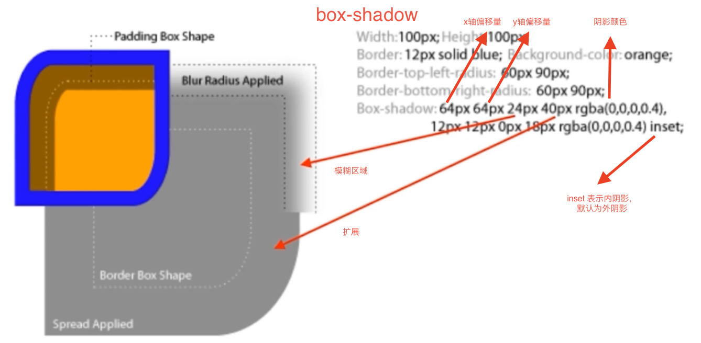

# Web Base(Web 基础)

本仓库包含部分 HTML 知识及全面详实的 CSS 知识。便于开发中的快速查询。

> 前置知识：对 HTML5、CSS3 有一定了解。
> 说明：本仓库的名词并不专业严谨，只求便于理解。

# 目录（Contents）

* [1. HTML](#1-html)
    * [1.1 HTML 常见元素](#11-html-常见元素)
        * [1.1.1 head 元素](#111-head-元素)
        * [1.1.2 body 元素](#112-body-元素)
    * [1.2 HTML 元素分类](#12-html-元素分类)
    * [1.3 HTML 元素嵌套关系](#13-html-元素嵌套关系)
    * [1.4 HTML 元素的默认样式](#14-html-元素的默认样式)
* [2. CSS](#2-css)
    * [2.1 CSS 基础](#21-css-基础)
        * [2.1.1 CSS 基本规则](#211-css-基本规则)
        * [2.1.2 选择器](#212-选择器)
            * [2.1.2.1 选择器的分类](#2121-选择器的分类)
            * [2.1.2.2 选择器的权重](#2122-选择器的权重)
    * [2.2 CSS 布局](#22-css-布局)
        * [2.2.1 非布局样式](#221-非布局样式)
            * [2.2.1.1 文字 - 字体](#2211-文字---字体)
            * [2.2.1.2 文字 - 行高](#2212-文字---行高)
    * [2.3 [CSS 布局]](#23-css-布局)
        * [2.3.1 table 布局](#231-table-布局)
        * [2.3.2 display and position](#232-display-and-position)
            * [2.3.2.1 盒子模型](#2321-盒子模型)
            * [2.3.2.2 display - 元素的显示类型](#2322-display---元素的显示类型)
            * [2.3.2.3 position - 元素的位置](#2323-position---元素的位置)
        * [2.3.3 flexbox 布局](#233-flexbox-布局)
        * [2.3.4 float 布局](#234-float-布局)
        * [2.3.5 inline-block 布局](#235-inline-block-布局)
        * [2.3.6 响应式布局](#236-响应式布局)
    * [2.4 CSS 效果](#24-css-效果)
        * [2.4.1 box-shadow 阴影](#241-box-shadow-阴影)
        * [2.4.2 text-shadow 文字阴影](#242-text-shadow-文字阴影)
        * [2.4.3 border-radius 圆角](#243-border-radius-圆角)
        * [2.4.4 background 背景](#244-background-背景)
        * [2.4.5 clip-path 裁剪](#245-clip-path-裁剪)
    * [2.5 CSS 动画](#25-css-动画)
        * [2.5.1 transition 补间动画](#251-transition-补间动画)
        * [2.5.2 animations(keyframe) 关键帧动画](#252-animationskeyframe-关键帧动画)
    * [2.6 CSS 预处理器](#26-css-预处理器)
        * [2.6.1 预处理器之间的语法对照表](#261-预处理器之间的语法对照表)
    * [2.7 CSS 工程化](#27-css-工程化)

## 1. HTML

[h5o - HTML 大纲算法工具](http://h5o.github.io)

### 1.1 HTML 常见元素

#### 1.1.1 head 元素

head 元素 不会在页面上留下直接的内容，主要为页面相关资源及信息描述。

* 声明 - [meta](https://developer.mozilla.org/zh-CN/docs/Web/HTML/Element/meta)
    * `<meta charset='utf-8'>` - `charset`表示页面使用的字符集
    * `<mate name='viewport' content='width=device-width, initial-scale=1.0, maximum-scale=1.0, user-scalable=no‘>` - 控制缩放（此属性对多端适配非常有用）
        * `name='viewport'` - 视口，表示页面显示的范围
        * `width=device-width` - 显示宽度，`device-width` - 此处为设备宽度
        * `initial-scale=1.0` - 默认缩放，此处为1
        * `maximum-scale=1.0` - 最大缩放，此处为1
        * `user-scalable=no` - 用户缩放，此处为不允许用户缩放
* 标题 - [title](https://developer.mozilla.org/zh-CN/docs/Web/HTML/Element/title)
* 样式 - [style](https://developer.mozilla.org/zh-CN/docs/Web/HTML/Element/style)
* 链接 - [link](https://developer.mozilla.org/zh-CN/docs/Web/HTML/Element/link)
* 脚本 - [script](https://developer.mozilla.org/zh-CN/docs/Web/HTML/Element/script)
* 制定基础路径 - [base](https://developer.mozilla.org/zh-CN/docs/Web/HTML/Element/base)`<base href="" />`（较少使用，设置此标签则表示本页面中所有链接都基于此路径）

#### 1.1.2 body 元素

body 元素 的内容会直接出现在页面上。

> 括号中的内容为对应标签在 HTML5 中的语义，更多内容可访问：
https://developer.mozilla.org/zh-CN/docs/Glossary/语义#语义化元素

* 块级元素 - div / section（文章、文字） / article（文章） / aside（侧边栏、广告） / nav（菜单、导航） / header（头部） / footer（尾部） / i（icon 图标）
* 段落元素 - p
* 行内元素 - span / label / em（强调 - 斜体） / strong（强调 - 粗体）
* 表格元素 - [table](https://developer.mozilla.org/zh-CN/docs/Web/HTML/Element/table) / thead / tbody / tr / td / th
    * td
        * `colspan` - 跨列
        * `rowspan` - 跨行
* 列表元素 - ul / ol / li / dt / dd
* 表单元素 - form / [input](https://developer.mozilla.org/zh-CN/docs/Web/HTML/Element/Input) / [select](https://developer.mozilla.org/zh-CN/docs/Web/HTML/Element/select) / [textarea](https://developer.mozilla.org/zh-CN/docs/Web/HTML/Element/textarea) / [button](https://developer.mozilla.org/zh-CN/docs/Web/HTML/Element/button)
    * placeholder - 表单的默认显示（提示）内容
    * [form](https://developer.mozilla.org/zh-CN/docs/Web/HTML/Element/form)
        * `target` - 表单提交的地址
        * `method` - 表单提交的方式（GET/POST）
        * `enctype` - (POST请求时)提交时使用的编码格式
    * button
        * `type` - 按钮类型
            * `button`普通按钮
            * `submit`提交按钮（form中生效），`input` 中 `type='submit'` 与此作用相同
            * `reset`重置按钮（form中生效）
* 链接 - a / img
    * [a](https://developer.mozilla.org/zh-CN/docs/Web/HTML/Element/a)
        * `a[href]` - 链接地址
        * `a[target]` - 指定在哪里打开链接，`_self`(默认)在当前窗口打开；`_blank`新窗口打开
    * img
        * `img[src]` - 图片地址
        * `img[alt]` - 替换资源，图片不可用时使用

> 延伸：
> [HTML 参考
](https://developer.mozilla.org/zh-CN/docs/Web/HTML/Reference) | [HTML5
](https://developer.mozilla.org/zh-CN/docs/Web/Guide/HTML/HTML5) | [HTML表单指南
](https://developer.mozilla.org/zh-CN/docs/Learn/HTML/Forms) | [SEO(语义
)](https://developer.mozilla.org/zh-CN/docs/Glossary/语义)


### 1.2 HTML 元素分类

按默认样式分类： 块级 block、行内 inline、inline-block

按内容分类：
https://www.w3.org/TR/html5/dom.html#kinds-of-content


### 1.3 HTML 元素嵌套关系

* 块级元素可以包含行内元素
* 块级元素不一定能包含块级
* 行内元素一般不能包含块级元素

> 延伸：[Text-level semantics](https://www.w3.org/TR/html5/textlevel-semantics.html) | [22 Transitional Document Type Definition](https://www.w3.org/TR/1999/REC-html401-19991224/sgml/loosedtd.html) | [Allowed nesting of elements in HTML 4 (and XHTML 1.0)](http://jkorpela.fi/html/nesting.html)

### 1.4 HTML 元素的默认样式

浏览器会自动为一些元素加默认样式。

[CSS Reset](https://cssreset.com)
[CSS Tools: Reset CSS](https://meyerweb.com/eric/tools/css/reset/)
[YUI CSS Reset](https://cssreset.com/scripts/yahoo-css-reset-yui-3/)

CSS Reset 重置默认样式
[normalize.css](http://necolas.github.io/normalize.css/) |
[Github](https://github.com/necolas/normalize.css/)

[ex](Code/cssreset.css)

## 2. [CSS](https://developer.mozilla.org/zh-CN/docs/Web/CSS)

> CSS：层叠样式表（Cascading Style Sheet）
[CSS](https://developer.mozilla.org/zh-CN/docs/Glossary/CSS) |
[CSS 参考
](https://developer.mozilla.org/zh-CN/docs/Web/CSS/Reference)
[CSS 教程
](https://developer.mozilla.org/zh-CN/docs/Learn/CSS) |
[CSS 文档
](https://developer.mozilla.org/zh-CN/docs/Web/CSS)

### 2.1 CSS 基础

#### 2.1.1 CSS 基本规则

```text
选择器 {
    属性(Property): 值(Value);
    ...
}
```

> 值后面的分号(`;`)可以不加，但建议为每一行加上分号

#### 2.1.2 [选择器](https://developer.mozilla.org/zh-CN/docs/Learn/CSS/Introduction_to_CSS/Selectors)

* 匹配 HTML 元素
* 有不同的匹配规则
* 多个选择器可叠加

##### 2.1.2.1 [选择器的分类](https://developer.mozilla.org/zh-CN/search?q=选择器&topic=api&topic=css&topic=canvas&topic=html&topic=http&topic=js&topic=svg&topic=standards&topic=webdev&topic=webext&topic=webgl&topic=apps&topic=mobile)

1. 元素选择器 - a
2. [伪元素](https://developer.mozilla.org/zh-CN/docs/Web/CSS/Pseudo-elements)选择器 - ::before
3. 类选择器 - .class-name
4. 属性选择器 - [Property-name=Property-value]
5. [伪类](https://developer.mozilla.org/en-US/docs/Web/CSS/Pseudo-classes)选择器 - :hover
6. ID 选择器 - #id-name
7. 否定选择器 - :not(...)
8. 通用选择器 - * (匹配所有元素)
9. [组合选择器](https://developer.mozilla.org/zh-CN/docs/Learn/CSS/Introduction_to_CSS/Combinators_and_multiple_selectors)

##### 2.1.2.2 [选择器的权重](https://developer.mozilla.org/zh-CN/docs/Web/CSS/Specificity)

按先后顺序，同一级别下权重相同，不同级别下数值越小权重越高：

1. ID 选择器
2. 类 属性 伪类
3. 元素 伪元素
4. 其它

> 在同一元素被多个选择器选中时，浏览器会优先应用优先级较低的选择器的样式，再应用优先级高的选择器的样式，如果设定了重复的样式，则会使用优先级高的选择器的样式。

属性生效的其它规则：

* !important 优先级最高（除了另一个!important，谁不可覆盖）
* 内联样式 优先级高（高于 ID 选择器）
* 相同权重 后写的生效

### 2.2 CSS [布局](https://developer.mozilla.org/zh-CN/docs/Learn/CSS/CSS_layout)

#### 2.2.1 非布局样式

* 文字 - [字体](#2211-文字---字体)、字重(font-weight)、颜色、大小、[行高](#2212-文字---行高)
* 盒子 - 背景、边框
* 页面 - 滚动、换行
* 装饰性样式 - 粗体(font-weight)、斜体(font-style:itatic)、下划线(text-decoration)
* 其它 - 指针(cursor:point)、[CSS Hack](https://en.wikipedia.org/wiki/CSS_hack) (目前较少使用)

##### 2.2.1.1 文字 - 字体

* 字体族（使用字体族时不要加引号）
    serif(衬线字体)、sans-serif(非衬线字体)、monospace(等宽字体)、cursive(手写体)、fantasy(花体)
* 多字体（fallback）
* [网络字体、自定义字体](#网络字体\自定义字体)
* iconfont: https://www.iconfont.cn

> 在声明字体时先写平台独有的字体再加字体族是一个好的习惯
> ```css
> font-family: "PingFang SC", "Microsoft Yahei", monospace;
> ```
> 由于苹果用户在安装Office后也会有 `Microsoft Yahei`，但 `Microsoft Yahei` 在Mac上的效果不如 `PingFang SC` 因此将 `PingFang SC` 在前面

###### 网络字体\自定义字体

```css
/* 声明一个字体 */
@font-face {
    font-family: "IF";
    src: url("...")
}
font-family: "IF";
```

##### 2.2.1.2 文字 - 行高

行高由 line box 的高度决定，line box 的高度由 inline box 的高度决定

### 2.3 [CSS 布局](https://developer.mozilla.org/zh-CN/docs/Learn/CSS/CSS_layout)

常用布局：

* [table 表格布局](#231-table-布局)
* [float 浮动 + margin](#234-float-布局)
* [inline-block 布局](#235-inline-block-布局)
* [flexbox 布局](#233-flexbox-布局)

#### 2.3.1 table 布局

```html
<table>
    <thead>
        <!-- <th></th>会将标题加粗显示,此处为示范，实际生产中不建议将<td>同<thead>混用 -->
        <td>标题1</td><td>标题2</td><th>加粗标题</th>
    </thead>
    <tbody>
        <tr>
            <td>1-1</td><td>1-2</td><td>1-3</td>
        </tr>
        <tr>
           <td colspan="2">2-1 (跨两列)</td><td  rowspan=“2”>2-3 (跨两行)</td>
        </tr>
        <tr>
           <td>3-1</td><td>3-2</td>
        </tr>
    </tbody>
</table>

```

```html
<style>
    .table {
        display: table;
    }
    .table-row {
        display: table-row;
    }
    .table-cell {
        display: table-cell;
    }
</style>
<div class="table">
    <div class="table-row">
        <div class="table-cell">1-1</div>
        <div class="table-cell">1-2</div>
    </div>
    <div class="table-row">
        <div class="table-cell">2-1</div>
        <div class="table-cell">2-2</div>
    </div>
</div>
```

#### 2.3.2 display and position

##### 2.3.2.1 盒子模型



盒子占用的空寂 = height/width(content) + padding + border

##### 2.3.2.2 [display](https://developer.mozilla.org/zh-CN/docs/Web/CSS/display) - 元素的显示类型

常用属性：

* block(块级元素) - 有独立宽高，默认占据一行
* inline(内联元素/行内元素) - 没有独立宽高，默认不独立占据一行（类似于文本）
* inline-block(行内快极元素) - 对内相当于block有独立的宽高；对外相当于inline不会独立占据一行（类似于文本）

##### 2.3.2.3 [position](https://developer.mozilla.org/zh-CN/docs/Web/CSS/position) - 元素的位置

常用属性：

* static(静态布局，默认) - 文档流。不可添加 z-index 样式。
* relative(相对定位) - 相对于元素本身，relative 的偏移(top/left/right)，相对于元素本身，偏移后占用空间的计算仍按偏移之前的位置进行计算（偏移时不会改变它占据的空间）。可添加 z-index 样式定义层级。
* absolute(绝对定位) - 相对于最近的 relative 或 absolute(父元素) 定位，如果找不到则相对于 body 定位，脱离文档流，不会对其它元素的布局产生影响。可添加 z-index 样式定义层级。
* fixed(固定定位) - 相对于可视区域定位，脱离文档流，不会对其它元素的布局产生影响。可添加 z-index 样式定义层级。

#### 2.3.3 [flexbox](https://developer.mozilla.org/en-US/docs/Glossary/Flexbox) 布局

* 弹性盒子
* 盒子不来就是并列的

[兼容性](https://caniuse.com/#search=flexbox) 不好，慎用

```html
<style>
    .container{
        width:800px;
        height:200px;
        display: flex;
    }
    .left{ /* 固定宽度 */
        background: red;
        display: flex;
        width:200px;
    }
    .right{ /* 自适应宽度 */
        background: blue;
        display: flex;
        flex:1;
    }
</style>
<div class="container">
    <div class="left">
        左
    </div>
    <div class="right">
        右
    </div>
</div>
```

#### 2.3.4 [float 布局](https://developer.mozilla.org/zh-CN/docs/Learn/CSS/CSS_layout/Floats)

* 元素“浮动”
* 脱离文档流 - 不影响其他元素的布局
* 不脱离文本流 - 影响文本的布局

对自身的影响：

* 形成快（BFC）- 自主控制宽高，无论是什么元素
* 位置尽量靠上
* 位置尽量靠左（float: left）/右（float: right）

对兄弟元素的影响：

* 上面一般贴非 float 元素
* 身边贴 float 元素
* 不影响其它元素的位置
* 影响其它快极元素的文本

对父级元素的影响：

* 从布局上”消失“
* 高度塌陷 - 可添加 `overflow: auto` 解决此问题

```css
/* 解决 float 元素的父元素的影响 */
.container {
    content: ' ';
    clear: both; /* 清除浮动 */
    display: block;
    visibility: hidden;
    height: 0;
}
```

```html
<style>
    .container{
        width:800px;
        height:200px;
    }
    .left{
        background:red;
        /* float:left; */
        /* height:100%; */
        width:200px;
        position: absolute;
        height:200px;
    }
    .right{
        background:blue;
        float:right;
        width:200px;
        height:100%;
    }
    .middle{
        margin-left:200px;
        margin-right:200px;
    }

</style>
<div class="container">
    <div class="left">
        左
    </div>
    <div class="right">
        右
    </div>
    <div class="middle">
        中间
    </div>
</div>
```

#### 2.3.5 inline-block 布局

* 像文本一样排 block 元素
* 没有清除浮动的问题
* 需要处理间隙

```html
<style>
    .container{
        width:800px;
        height:200px;
        font-size:0;
    }
    .left{
        font-size:14px;
        background:red;
        display: inline-block;
        width:200px;
        height:200px;
    }
    .right{
        font-size:14px;
        background:blue;
        display: inline-block;
        width:600px;
        height:200px;
    }

</style>
<div class="container">
    <div class="left">
        左
    </div>
    <div class="right">
        右
    </div>
</div>
```

#### 2.3.6 响应式布局

* 在不同设备上正常使用
* 一般主要处理屏幕大小
* 主要方法：
    * 隐藏 + 折行 + 自适应空间
    * rem(根据字体大小调整) / [viewport](https://developer.mozilla.org/zh-CN/docs/Web/CSS/@viewport) / [media query(媒体查询)](https://developer.mozilla.org/zh-CN/docs/Web/CSS/媒体查询)

viewport - `<mate name='viewport' content='width=device-wid th, initial-scale=1.0, maximum-scale=1.0, user-scalable=no‘>`

### 2.4 CSS 效果

效果属性：

* [box-shadow](#241-box-shadow-阴影) - 投影(阴影)
* [text-shadow](#242-text-shadow-文字阴影) - 文字投影(阴影)
* [border-radius](#243-border-radius-圆角) - 圆角
* [background](#244-background-背景) - 背景
* [clip-path](#245-clip-path-裁剪) - 裁剪

#### 2.4.1 [box-shadow](https://developer.mozilla.org/zh-CN/docs/Web/CSS/box-shadow) 阴影



* 营造立体感（层次感）
* 充当没有宽度的边框 - `box-shadow:0, 0, 0, 5px, #000;` 就可以画出一个 5px 宽的黑色边框。
* 特殊效果

#### 2.4.2 [text-shadow](https://developer.mozilla.org/zh-CN/docs/Web/CSS/text-shadow) 文字阴影

* 营造立体感（层次感）
* 品质感

#### 2.4.3 [border-radius](https://developer.mozilla.org/zh-CN/docs/Web/CSS/border-radius) 圆角

* 圆角矩形 `border-radius: 10px;`
* 圆形 `border-radius: 50%;`
* 半圆 / 扇形 `border-top-left-radius: 100%;`
* 奇怪的角

#### 2.4.4 [background](https://developer.mozilla.org/zh-CN/docs/Web/CSS/background) 背景

* 纹理、图案
* 渐变
* [雪碧图](https://zh.wikipedia.org/wiki/精灵图)动画
* 背景图尺寸适应

#### 2.4.5 [clip-path](https://developer.mozilla.org/zh-CN/docs/Web/CSS/clip-path) 裁剪

* 裁剪容器
* 按几何图形裁剪
* 自定义图形裁剪

### 2.5 CSS 动画

CSS 中动画的类型：

* [transition](#251-transition-补间动画) 补间动画
* [keyframe](#252-animationskeyframe-关键帧动画) 关键帧动画
* 逐帧动画

#### 2.5.1 [transition](https://developer.mozilla.org/zh-CN/docs/Web/CSS/CSS_Transitions) 补间动画

[transition-timing-function(timing/easing)](https://developer.mozilla.org/zh-CN/docs/Web/CSS/transition-timing-function)

[CSS 默认 easing](https://easings.net/zh-cn) | [Github](https://github.com/ai/easings.net)

[自定义 easing](https://matthewlein.com/tools/ceaser)

#### 2.5.2 [animations(keyframe)](https://developer.mozilla.org/zh-CN/docs/Web/CSS/CSS_Animations) 关键帧动画

### 2.6 CSS 预处理器

* 基于 CSS 的另一种语言
* 通过工具编译成 CSS
* 添加了很多 CSS 不具备的特性
* 提升 CSS 文件的组织

常见的CSS 预处理器：

* [less](http://lesscss.org) |
[中文网](http://lesscss.cn) |
[Lee - Bootstarp](http://www.bootcss.com/p/lesscss/) |
[Github](https://github.com/less/less.js) - 使用 js 编写，入门简单，复杂属性实现不友好
* [scss(sass)](https://sass-lang.com) |
[中文网](https://www.sass.hk) |
[scss 在线转换](https://www.sass.hk/css2sass/) |
[Github](https://github.com/sass/sass) - 使用 ruby 编写，需要编译，有基于 Node 的版本

CSS 预处理器 实现的功能：

* 嵌套 - 反应层级和约束
* 变量和计算 - 加少重复代码
* Extend 和 Mixin - 代码片段（类似于function）
* 循环 - 适用于复杂有规律的样式
* import - CSS 文件模块化

CSS 预处理器框架：

* SCSS  
**Compass** - [Page](http://compass-style.org) |
[Github](https://github.com/Compass/compass) 封装有兼容性问题的属性
* Less  
**Lesshat** - [Page](http://lesshat.madebysource.com) |
[Github](https://github.com/madebysource/lesshat)  
**EST** - [Page](http://ecomfe.github.io/est/) |
[Github](https://github.com/ecomfe/est/)
* 提供现成的 mixin
* 类似js类库，封装常用功能

#### 2.6.1 预处理器之间的语法对照表

> css 预处理器（less/scss）之间的语法对比  

| 项目 | less(`.less`) | scss/sass(`.scss`) | css(`.css`) | 说明 |
| ----- | ---- | ---- | --- | ---- |
| 嵌套   | `.wrapper {`<br/>&emsp;`background: white;`<br>&emsp;`a {`<br/>&emsp;&emsp;`font-size: 12px;`<br/>&emsp;&emsp;`&:hover {`<br/>&emsp;&emsp;&emsp;`background: red;`<br/>&emsp;&emsp;`}`<br/>`}` | `.wrapper {`<br/>&emsp;`background: white;`<br>&emsp;`a {`<br/>&emsp;&emsp;`font-size: 12px;`<br/>&emsp;&emsp;`&:hover {`<br/>&emsp;&emsp;&emsp;`background: red;`<br/>&emsp;&emsp;`}`<br/>`}` | `.wrapper { background: white; }`<br/>`.wrapper a { font-size: 12px; }`<br/>`.wrapper a:hover { background: red; }` | less 和 scss 的嵌套语法完全相同。<br />`&` 表示与所在括号的选择器同级 | <!-- 嵌套 -->
| 变量   | `@fontsice: 12px;`<br />`@bgcolor: red;`<br />`font-size: @fontsize;`<br />`background: lighten(@bgcolor, 40%);`<br />`border-color: @bgcolor;` | `$fontsice: 12px;`<br />`$bgcolor: red;`<br />`font-size: $fontsize;`<br />`background: lighten($bgcolor, 40%);`<br />`border-color: $bgcolor;` | `font-size: 12px;`<br />`background: #ffcccc;`<br />`border-color: red;` | **less** 中使用 `@` 声明变量<br />**scss** 中使用 `$` 声明变量<br />**作用**：提高代码的可维护性，降低 css 样式的修改成本。<br />**变量**：包含单位，运算时也会带单位运算。<br />由于 css 中不存在变量，因此生成的 css 文件会将变量替换成计算后的结果，变量的声明会被丢弃。 | <!-- 变量 -->
| mixin<br />(混入)  | `@bgcolor: green;`<br />`.mixin_bg(@bgcolor) {`<br />&emsp;`background: @bgcolor;`<br />&emsp;`font-size: 12px;`<br />`}`<br />`.bg {`<br />&emsp;`.mixin_bg(@bgcolor)`<br />&emsp;`border-color: red;`<br />`}` | `$bgcolor: green;`<br />`@mixin mixin_bg($bgcolor) {`<br />&emsp;`background: $bgcolor;`<br />&emsp;`font-size: 12px;`<br />`}`<br />`.bg {`<br />&emsp;`@include mixin_bg($bgcolor)`<br />&emsp;`border-color: red;`<br />`}` | `.bg { background: green; font-size: 12px; border-color: red; }` | **less** 中的 mixin<br />声明：`.mixin名称([参数（可选）]){ 样式 }`，<br />调用：`.mixin名称([参数])`<br />**scss** 中的 mixin<br />声明：`@mixin mixin名称([参数（可选）]){ 样式 }`<br />调用：`@include mixin名称([参数])`<br />**作用**：提高代码的可维护性，提取重复样式，在 css 中进行代码复用。<br />**副作用**：在过多使用后会导致生成的 css 样式文件的重复代码增多，可通过使用 extend(继承) 解决。<br />**mixin(混入)**：可认为是对重复样式的包装和复用，类似于面向对象语言中的方法，可带有参数。mixin 定义后可直接调用，mixin 中也可以调用 mixin。<br />由于 css 中不存在 mixin，因此生成的 css 文件会将 mixin 中的样式复制到调用的地方（变量会先进行计算），mixin 的声明会被丢弃。<br />**注意**：less 中不带参数的 mixin 与 css class 语法上只差一对小括号，css class 也可以作为 mixin 调用，且会保留在编译后的 css 文件中（mixin 会被丢弃），但个人不推荐将 css class 作为 mixin 调用，以免混淆。scss 中没有这个问题。 | <!-- mixin -->
| extend<br />(继承) | `.bg {`<br />&emsp;`background: white;`<br />&emsp;`font-size: 12px;`<br />`}`<br />`.nav:extend(.bg) {`<br />&emsp;`border: red;`<br />`}`<br />`.banner {`<br />&emsp;`&:extend(.bg)`<br />&emsp;`border: green;`<br />`}` | `.bg {`<br />&emsp;`background: white;`<br />&emsp;`font-size: 12px;`<br />`}`<br />`.nav {`<br />&emsp;`@extend .bg;`<br />&emsp;`border: red;`<br />`}`<br />`.banner {`<br />&emsp;`@extend .bg;`<br />&emsp;`border: green;`<br />`}` | `.bg .nav .banner { background: white; font-size: 12px; }`<br />`.nav { border: red; }`<br />`.banner { border: green; }` | **less** 中使用 extend：`:extend(.类名)`<br />**scss** 中使用 extend：`@extend .类名;`<br />**作用**：提取选择器，将公共样式写在一起，在 css 中进行代码复用，解决 mixin 可能造成的生成 css 文件重复代码过多的问题。<br />**extend(继承)**：可认为是对 mixin 的升级，但二者在编译生成时有较大差异：extend 会将重复的样式提取出来放到单独的选择器中，可更好的完成代码的复用，并且不会造成过多的代码重复的问题。 | <!-- extend -->
| loop<br />(循环)   | 递归：<br />`.gen(@n) when (@n > 0) {`<br />&emsp;`.gen(@n - 1);`<br />&emsp;`.cot-@{n} {`<br />&emsp;&emsp;`width: 100px/3*@n;`<br />&emsp;`}`<br />`}`<br />`gen(3);` | 递归：<br />`@mixin gen($n) {`<br />&emsp;`@if ($n > 0) {`<br />&emsp;&emsp;`@include gen($n - 1);`<br />&emsp;&emsp;`.col-#{$n} {`<br />&emsp;&emsp;&emsp;`width: 100px/3*$n;`<br />&emsp;&emsp;`}`<br />&emsp;`}`<br />`}`<br />`gen(3);`<br />循环：<br />`@for $i from 1 through 3 {`<br />&emsp;`.col-#{$i} {`<br />&emsp;&emsp;`width: 100px/3*$i;`<br />`}` | `.col-1 { width: 100ox; }`<br />`.col-2 { width: 200ox; }`<br />`.col-3 { width: 300ox; }` | **less** 中的循环：<br />递归：`.mixin名称(计数器) when (退出条件) { .mixin名称(计数器 - 1); 循环体; }`<br />**scss** 中的循环：<br />递归：`@mixin mixin名称(计数器) { @if (退出条件) { @include mixin名称(计数器 - 1); 循环体; } }`<br />循环：`@for 计数器 from 起始点 through 结束点 { 循环体 }`<br />**作用**：生成高度有规律的样式。<br />**loop(循环)**：循环生成样式。less 中只能使用递归的方式实现循环；sess 中可使用递归和 for 循环两种方式实现循环。 | <!-- loop -->
| import<br />(模块化) | `@import "url"` | `@import "url"` | - | less 与 scss 中的 import 语法形式与 css 原生 `@import` 相同：`@import "url"`<br />**作用**：css 模块化，提高代码可维护性，解决 css 中默认 `@import` 不合并，不复用链接导致的 http 请求较多导致的性能问题。<br />**import(模块化)**：将引入的 css 模块合并为一个文件，在模块细分，文件细碎时能显著减少生成的 css 文件数量，有效减少 http 请求数量，提高性能。 | <!-- import -->

### 2.7 CSS 工程化

组织 优化 构建 维护

[PostCSS](https://postcss.org) |
[中文网](https://www.postcss.com.cn)
[Github](https://github.com/postcss/postcss) |
[插件](https://www.postcss.parts)
[Gitter](https://gitter.im/postcss/postcss) - 用 JavaScript 工具和插件转换 CSS 代码的工具

常用插件：

* [import](https://github.com/postcss/postcss-import) - 模块合并
* [autoprefixer](https://github.com/postcss/autoprefixer) | config: [browserslist]((https://github.com/browserslist/browserslist) ) - 自动加前缀（解决兼容性问题）

* [cssnano](https://cssnano.co) | [Github](https://github.com/cssnano/cssnano) - CSS 压缩
* [cssnext](http://cssnext.io) |
[Github](https://github.com/MoOx/postcss-cssnext) | [blog](https://moox.io/blog/deprecating-cssnext/) - 使用新的 CSS 特性
* [precss](https://github.com/jonathantneal/precss) | [demo](https://jonathantneal.github.io/precss/) - 提供 变量、mixin、循环等特性
* [css-modules](https://github.com/css-modules/css-modules) - 组件化
* [styled-components](https://www.styled-components.com/) |
[Github](https://github.com/styled-components) - 组件化

[browserslist](https://github.com/browserslist/browserslist) - 浏览器列表（数据来自 [can i use](https://caniuse.com))
